# Alejandro Zappala
## Geospatial Data Product Management

[@alayzappala](https://twitter.com/alayzappala)

---

## Portfolio

### Datamad 2017

[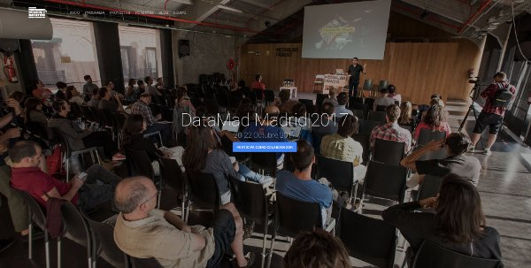](https://medialab-prado.github.io/datamad2017)

2017, Desarrollo de la web y asistencia técnica a los proyectos del [DataMad17](https://medialab-prado.github.io/datamad2017/)

---

### Visualizar'17 Migrations

Participación como mentor en [VISUALIZAR'17](http://medialab-prado.es/article/visualizar17-migraciones)

---
### Introducción a los Sistemas de Información Geográfica

[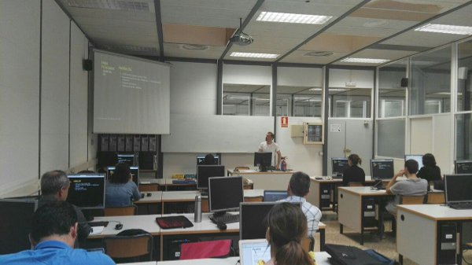]()

Introducción a los Sistemas de Información Geográfica en curso periodismo de datos **Cátedra Govern Obert**

---

### Diagnóstico de accesibilidad urbana Tetuán

[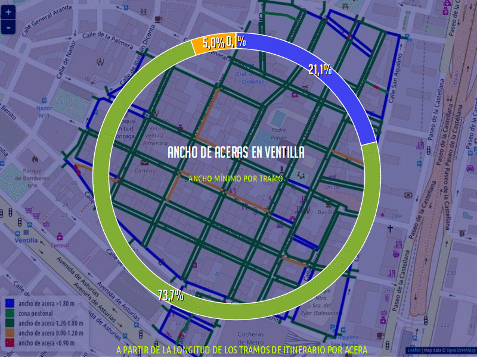](http://adappgeo.net/mapa/diagnosticotetuan)

2017, Webmap correspondiente a los resultados del **diagnóstico de accesibilidad** del barrio de Cuatro Caminos y de la zona de la Ventilla del Barrio de Almenara del Distrito de Tetuán en el municipio de Madrid

---

### Jornadas de Periodismo de Datos 2017: cada dato cuenta

[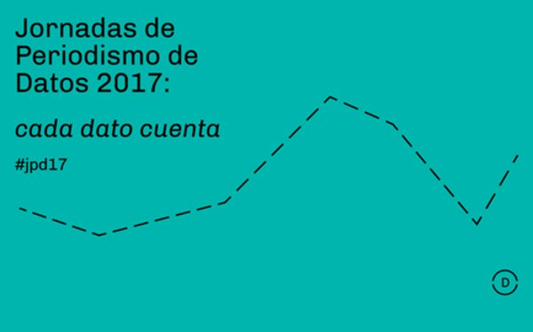](https://medialab-prado.github.io/tpd17/)

Participación en las [Jornadas de Periodismo de datos 2017](http://medialab-prado.es/article/jornadas-de-periodismo-de-datos-2017-jpd17-cada-dato-cuenta)

+ como ponente: [enlace a la presentación](http://alejandrozappala.com/presentacion/cartography/)
+ Apoyo técnico a los [proyectos](https://medialab-prado.github.io/tpd17/)

---
### Cursos Avanzados E.Torroja 2016

2016, Presentación de los mapeos de accesibilidad en el Seminario 5: Accesibilidad y Seguridad de Utilización

---
### Accesibilidad para Silla de Ruedas

[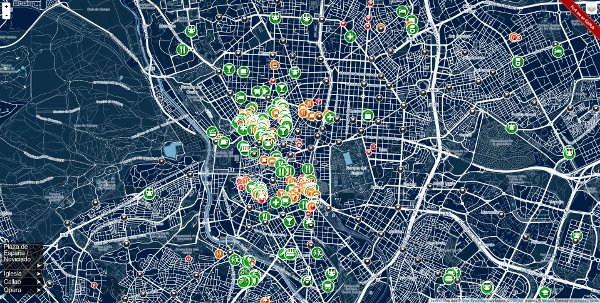](http://adappgeo.net/mapa/)

2016, Mapa de los lugares en los que se ha significado la accesibilidad en silla de ruedas mediante OpenStreetMap

---
### Luces de Bohemia

[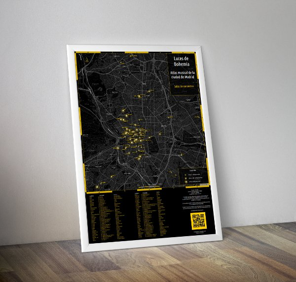](http://lucesdebohemia.com)

2016, Mapa web e impreso de las **salas de conciertos, locales de ensayo y tiendas de instrumentos** de la ciudad de Madrid

---

### Visualizar'16

[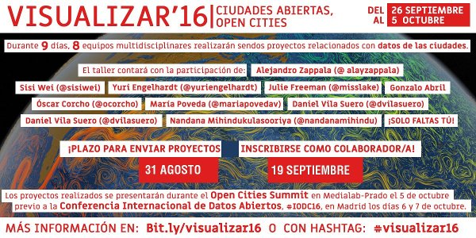](http://medialab-prado.es/article/visualizar16-ciudades-abiertas-open-cities)

Participación como apoyo técnico en [VISUALIZAR'16](http://medialab-prado.es/article/visualizar16-ciudades-abiertas-open-cities)

---
### Cartografía Colaborativa

[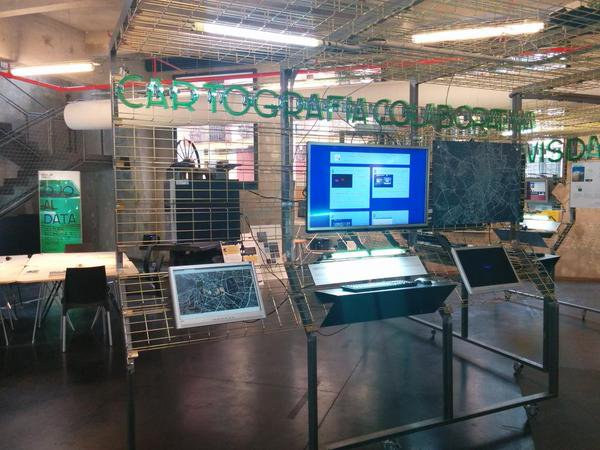](http://medialab-prado.es/article/ojoaldata)

**17 Marzo al 6 de Junio de 2015**. Participación en la exposición Ojo al Data organizada por **Medialab-Prado**, con el módulo titulado 'Cartografía Colaborativa'

---

### CIVICS

[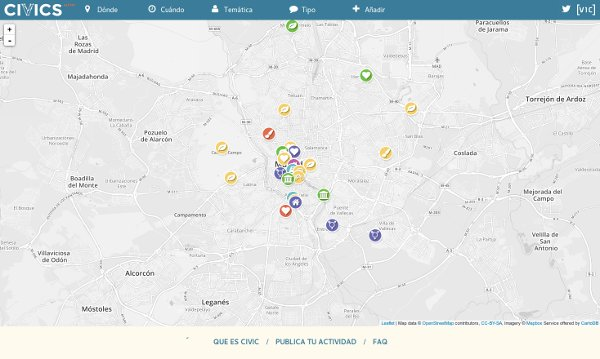](http://civics.es)

[CIVICS](http://civics.es) es una agenda de actividades geolocalizadas y un mapa de las iniciativas ciudadanas que las organizan. En octubre de 2015, se unió al proyecto [#losmadriles](http://www.losmadriles.org), organizado por **Intermediae** , la **Federación Regional de Asociaciones Vecinales de Madrid** (FRAVM), **Zuloark + Lys Villalba**, **Vivero de Iniciativas Ciudadanas** [VIC], **Paisaje Transversal** y **Todo por la Praxis**

---

### Taller WebMapping

[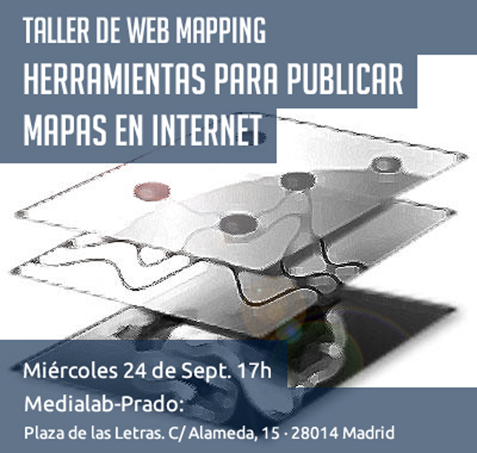](http://adappgeo.net/taller/webmapping/)

2014, Microsite del Taller sobre herramientas cartográficas, dentro del taller de Ciencia Ciudadana organizado por [MediaLab-Prado](http://medialab-prado.es/article/herramientasparapublicarmapaseninternet) el 24 de septiembre de 2014

---

### Accesibilidad de las Playas Españolas

[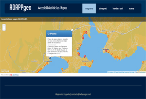](http://adappgeo.net/mapa/playas/magrama.html)
2014, Tres Mapas con la información de todo el litoral español indicando su accesibilidad

---

### Parking Reservado en Madrid

[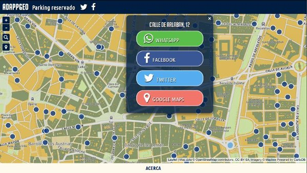](http://adappgeo.net/mapa/parking/madrid/)

2015, Aplicación web para localizar **plazas de aparcamiento reservado a personas con discapacidad** en la ciudad de Madrid

---

### Accessibility Mapping Parties

[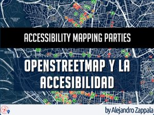](http://adappgeo.net/taller/AMP/)

2013-actualidad, Microsite de los talleres impartidos para recoger y añadir datos de accesibilidad a OpenStreetMap. Con colaboraciones de [Geoinquietos Madrid](http://wiki.osgeo.org/wiki/ACCESSIBILITY_MAPPING_PARTY_3.0), [Moenia](http://moenia.es/), [Aprende tu barrio](https://aprendetubarrio.wordpress.com/), [labroma.org](http://www.labroma.org/blog/2015/10/12/resultados-de-la-accessibility-mapping-party-5-0-tetuan/), la **ETSI Topografía, Geodesia y Cartografía** y **Medialab-Prado**

---

### 4º Congreso CENTAC

[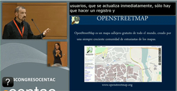](http://adappgeo.net/blog/archivos/548)

2013, Ponencia en el [4º Congreso CENTAC](http://www.centac.es/es/4congreso/inicio) , en representación de **Geoinquietos Madrid**, en la mesa de debate donde se abordaba el tema: Beneficio y aplicación de Big Data en PYMES y pequeñas asociaciones

+ [Pulsa para acceder al video](https://youtu.be/27tv2rp0SZs?t=57m28s)
+ [Ver las diapositivas](http://slidesha.re/1aSiB4J)

---

## Acerca de mí

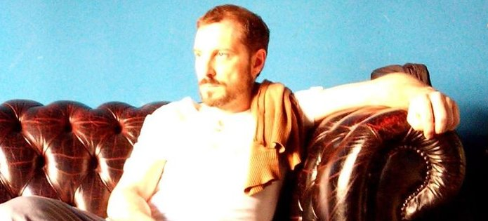

Me dedico a la Cartografía, a proyectos relacionados con los Sistemas de Información Geográfica, Modelos Digitales del Terreno, Bases de Datos y a la Topografía desde 1998.

Colaboro en proyectos impulsados por iniciativas sociales, como CIVICS, del Vivero de Iniciativas Ciudadanas.

Mantengo la web [adappgeo.net](http://adappgeo.net), donde me acerco al mundo de la accesibilidad a través de la cartografía

Mientras, saco algún tiempo para aprender y/o divulgar las ciencias cartográficas organizando y asistiendo a diversos talleres y geoquedadas.

Para mantenerme en forma, quedo una vez por semana para tocar la guitarra con los amigos.

---

## Formación Académica

+ Máster Oficial de Ingeniería Geodésica y Cartografía por la Universidad Politécnica de Madrid, especializándome en la Gestión y Difusión de la Geoinformación.

+ Ingeniero Técnico en Topografía por la Universidad Politécnica de Madrid

+ Diversos cursos certificados online en Data Science, R Programming, Data Mining, Programación para Android o HTML5 por Coursera o Miriadax

---

## Skills

### Cartografía

+ Partnership con www.cartodb.com (ADAPPgeo)
+ Asesoría, Project Management y Desarrollo de productos cartográficos online (Web Mapping) e impresos
+ Bases de Datos. PostGres, PostGIS, SQL, MySQL
+ Sistemas de Información Geográfica. ArcGIS, QGIS, gvSIG
+ Álgebra de Mapas. Raster y Vectorial
+ Modelos Digitales del Terreno, LIDAR

### Infraestructuras de Datos Espaciales

+ Normativas y legislaciones
+ Modelado de datos geográficos UML
+ INSPIRE
+ Servicios de mapas. Geoserver, Mapserver

### Data Science

+ Data Mining
+ Limpieza y modelado de datos
+ Estadística, Geoestadística
+ Python, R, Matlab

### Project Management

+ Facilitador de flujo de información técnica y riguroso con la documentación
+ Curioso ante cualquier herramienta tecnológica
+ Obra civil: Excel, MProject, Presto, Primavera

### Topografía

+ Redacción de Proyectos
+ Trabajo de campo: Estación Total, Nivel, GPS
+ Medición de parcelas
+ Oficina técnica, mediciones, certificaciones...

### Delineación

+ CAD. Autocad, Microstation
+ Delineante proyectista Obra Civil

### Programación y Desarrollo Web

+ Frontend: HTML5, Javascript (JQuery, AngularJS...); Wordpress.
+ Backend: PHP, Python, NodeJS, Jekyll

## Contacto

Puedes enviarme un correo a: **contacto(arroba)adappgeo.net**
